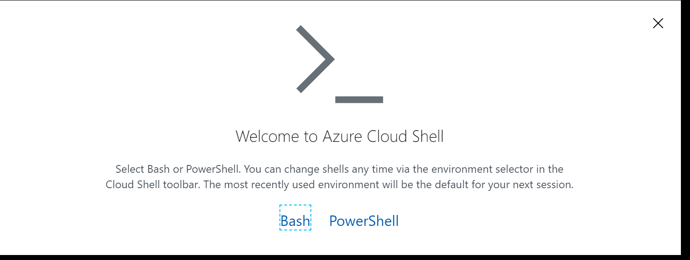
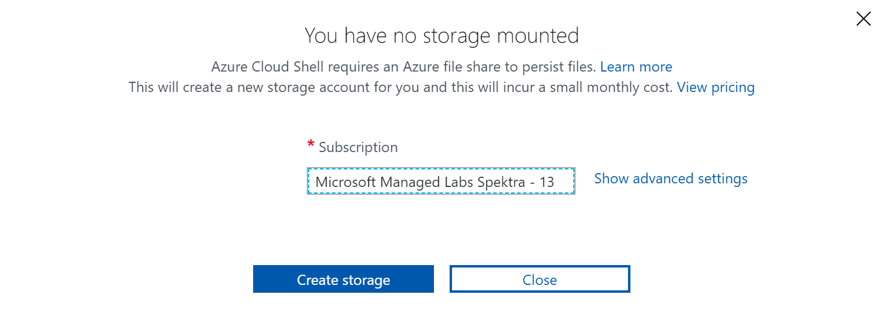
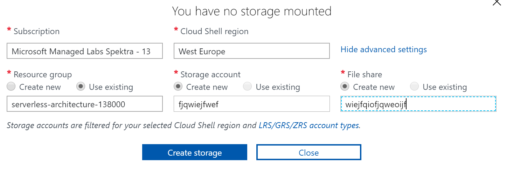

# Cloud Shell setup instructions

## Description

For the labs that use Azure Cloud Shell, please **follow these instructions carefully** as not doing so will require support and impact your available time for the lab. 

Azure Cloud Shell is an interactive, authenticated, browser-accessible shell for managing Azure resources.

## Activating your Bash cloud shell

1. Click **Bash**



2. Click **Show Advanced Settings**


3. Storage and File Share name

Please provie a **globally unique name** to both the Storage Account and the File Share Name

Example (**replace with your own**):
* Storage account: kjfjwhcnkd
* File Share: kjfjwhcnkdfiles



4. Click **Create storage**

Your cloud shell will take a moment to become available. You will then be able to run bash, azure cli and kubectl commands, among others.

## Tip

In your cloud shell, you can open a code editor by typing

```
code .
```

## More info

Curious about exploring more about Azure Cloud Shell? [Browse the docs](https://docs.microsoft.com/en-us/azure/cloud-shell/overview).